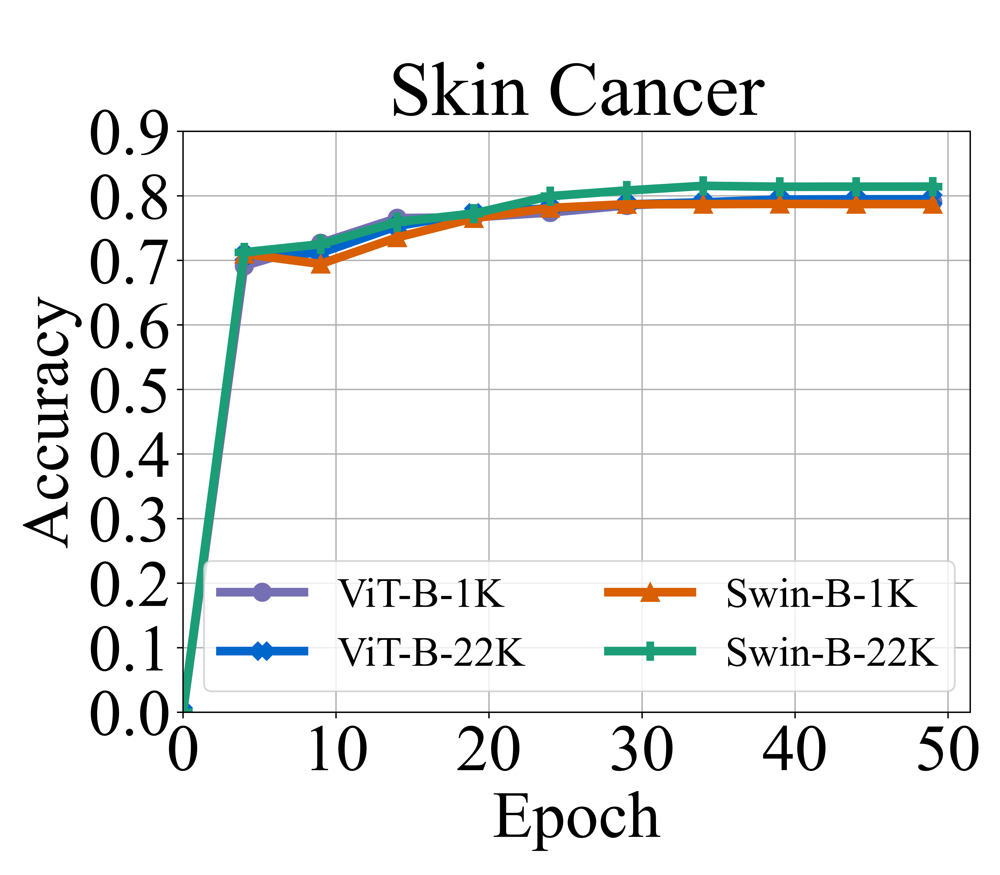

# LMEraser: Large Model Unlearning through Adaptive Prompt Tuning

## Aditional result for skin cancer



## Environment Setup

This code has been tested with Python 3.11.5 and PyTorch 2.1.2 with CUDA 12.1 on Ubuntu 22.04. The required packages are listed in `environment.yaml`.

**To set up a conda environment, please follow these steps:**

```bash
conda env create -f environment.yaml -n lmeraser
conda activate lmeraser
```

## File Structure

The structure of the repository is as follows:

```bash
.
├── arguments.py
├── data_utils
│   ├── datasets
│   │   ├── cifar
│   │   │   └── dataset.py
│   │   ├── gtsrb
│   │   │   └── dataset.py
│   │   ├── __init__.py
│   │   └── svhn
│   │       └── dataset.py
│   ├── loader.py
│   └── transforms.py
├── environment.yaml
├── eraser
│   ├── eraser.py
│   └── main.py
├── launch.py
├── LICENSE
├── models
│   ├── backbones
│   │   ├── backbone_swin.py
│   │   ├── backbone_vit.py
│   │   ├── backbone_vit_old.py
│   │   └── __init__.py
│   ├── builder.py
│   ├── checkpoints
│   │   ├── swin_base_patch4_window7_224.pth
│   │   ├── swin_base_patch4_window7_224_22k.pth
│   │   ├── vit_base_p16_224_in1k.pth
│   │   └── vit_base_p16_224_in22k.pth
│   ├── model_zoo
│   │   ├── __init__.py
│   │   ├── swin.py
│   │   └── vit.py
│   └── prompters.py
├── README.md
├── scripts
│   ├── run_distributed_gpu.sh
│   ├── run_one_gpu.sh
│   └── run_sbatch.sh
└── utils
    ├── distributed.py
    ├── file_io.py
    ├── logging.py
    ├── lr.py
    └── seed.py
```

## Dataset Preparation

Datasets are sourced from torchvision and downloaded automatically. For more details, please refer to [torchvision datasets](https://pytorch.org/vision/stable/datasets.html). The custom datasets directory can be set using `--base_dir` when running the code.

## Pre-trained Model Preparation

The pre-trained vision models used can be downloaded from the provided links and should be placed in `models/checkpoints/`.

### Pre-trained Models

| Backbone   | Pre-trained Objective | md5sum                         |
|------------|-----------------------|--------------------------------|
| vit-b-1k   | Supervised            |4423d3eecb5a0e00c353217a992d300f|
| vit-b-22k  | Supervised            |b3563fde27a47c2017e78044a0a72748|
| swin-b-1k  | Supervised            |733836a1b1b88a8ec21da708c35bd29e|
| swin-b-22k | Supervised            |bf9cc182ae5e417f97390e2b21a0eb09|

<!-- All models are available via the timm package.  -->
All models are available here [Google Drive](https://drive.google.com/drive/folders/10dVGKwgjuiN6AYHOhz7MhmiEVIYvWfvY?usp=drive_link).

## Training

Three scripts are provided for training on a single GPU, multiple GPUs, and a Slurm cluster, respectively. These scripts are located in `scripts/`.

## Changable Arguments

Key arguments are listed in `arguments.py`. The default settings are configured for training on CIFAR-100 with a ViT-22k backbone.

### Important Arguments

- `--erasing_method`: Select the erasing method (e.g., `lmeraser`, `random_part_tuning`).
- `--base_dir`: Directory to store datasets.
- `--test_dataset`: Dataset for training.
- `--pretrained_model`: Pre-trained model to use.
- `--one_prompt`: Use one or multiple prompts (default: `False`).
- `--num_gpus`: Number of GPUs to use.
- `--batch_size`: Total batch size.
- `--num_epochs`: Number of training epochs.
- `--lr`: Learning rate.
- `--distance_threshold`: Distance threshold for clustering.

## Acknowledgement

This repository is partially based on [VP](https://github.com/hjbahng/visual_prompting), [VPT](https://github.com/KMnP/vpt), and [DAM-VP](https://github.com/shikiw/DAM-VP). We thank the authors for their impressive works!

## License

This code is released under the MIT License (see LICENSE file for details).
